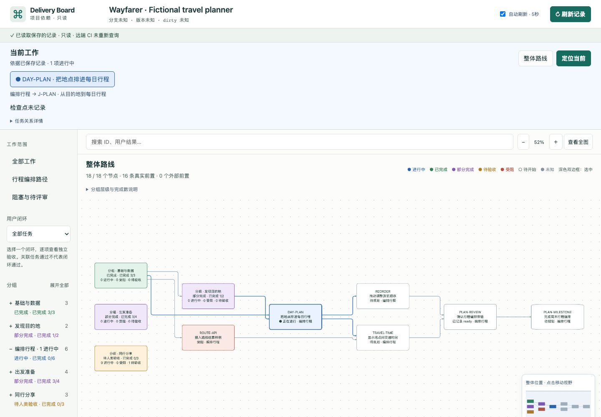

# Delivery Board

**See what is happening now, where it belongs, and what depends on it.**

A local, read-only dependency board that evolves with your saved project records. It shows current work, task/group progress, blockers, and independent journey verification. It does not run your application or infer progress from unrecorded conversations.

[中文说明](README.zh-CN.md) · [Source contract](docs/ADAPTER-CONTRACT.md) · [Companion skill](skills/delivery-board/SKILL.md)

## Start with your coding agent

Paste this prompt into an agent that can access your local files and terminal. Replace the project path, or leave it out to try only the demo. **You do not need to install a Skill first.**

```text
Help me set up https://github.com/msu1201/delivery-board and try its fictional demo.
My existing project is: /absolute/path/to/my-project

Keep the tool checkout separate from my project. Reuse a matching existing checkout,
otherwise git clone it into a suitable sibling/tool directory without overwriting files.
Check Node.js >=22 and npm; explain any missing prerequisites. Read the repository
README and skills/delivery-board/SKILL.md directly, install with npm ci, then run
npm run demo. Give me the local URL if you cannot open a browser.

For my project, inspect existing .delivery-board records before running init.
Use the skill's bootstrap procedure to review my available plans, docs and project
history. You may inspect local code and Git history read-only. Only use remote
issues/PRs/CI when relevant and accessible with my existing authorization.
If history is incomplete, inventory current capabilities and propose a task/phase
baseline with sources and uncertainties; ask only about gaps that materially affect
it. Do not invent dependencies, progress, human acceptance or delivery from code.
Save supported records, keep uncertain facts unknown, validate with check and open
the board. Do not modify business code or global agent settings. Explain how to keep
records current, and report anything you could not complete. If I omitted a project
path, stop after the demo instead of connecting the tool repository as my project.
```

The Agent does the setup and initial project inventory; the application displays the resulting saved records. This prompt is a workflow for your agent, not an autonomous scanner built into `init`. It may need clarification if the intended scope or project facts are missing.



Every public screenshot and demo uses **Wayfarer**, an entirely fictional travel-planner project. No private project data is required.

## Try it

Requires Node.js 22+ and npm. For a Git checkout:

```sh
git clone https://github.com/msu1201/delivery-board.git
cd delivery-board
npm ci
npm run demo
```

Alternatively, use **Code → Download ZIP**, extract it, open a terminal in the extracted directory, then run `npm ci` and `npm run demo`. Clone and ZIP provide the same application; choose either one.

The browser opens automatically. The terminal prints the actual local URL and viewer PID. A busy port is left untouched; the viewer chooses another available port. No background service is installed. Repeat the command to reopen/reuse the viewer. `--no-open` prints the URL without opening a browser.

## Connect your project

From the downloaded board directory (replace the example path):

```sh
npm run init -- "/path/to/your-project"
npm run open -- "/path/to/your-project"
```

This creates only `.delivery-board/config.json`, `graph.json`, and `WORKFLOW.md` inside that project. Existing setup is never overwritten. The initial graph is intentionally empty: `init` does not scan your code or invent a roadmap.

Populate that graph from your agreed task records using the [schema and examples](docs/ADAPTER-CONTRACT.md), or use the Agent prompt above. `init` creates the container; the Agent following the Skill organizes your project into records. Review uncertain statuses and dependencies. Then validate:

```sh
node src/entry.js check "/path/to/your-project"
```

For a shorter optional command, run `npm link` once in the downloaded board directory. Then `delivery-board open "/path/to/your-project"` works from other directories. This is a local link, not an npm-registry installation.

## How an existing project becomes a board

| Part | Responsibility |
| --- | --- |
| Application | Read configured records, validate and render them; optionally read local Git metadata. No active remote GitHub/CI queries. |
| `init` command | Create an empty `.delivery-board` setup without overwriting an existing one. |
| Agent + Skill instructions | Inventory relevant project evidence, draft tasks/groups/dependencies/journeys, reconcile uncertainties and maintain saved records as work evolves. |

For a well-documented project, the Agent starts from the agreed roadmap, specifications, task records, handoffs and acceptance evidence. Local Git history can establish what changed and when. Relevant authorized issues, PRs and CI can supply additional evidence. A recorded CI result may be displayed by the viewer; this is different from the viewer querying GitHub itself.

With incomplete history, start from **today's baseline**, not a fabricated reconstruction. The Agent inspects the current capabilities, entry points and available tests, then asks about the intended outcome and current priority where necessary. Existing code supports “implementation found,” not “accepted” or “delivered.” Tests support only their actual tested scope. Missing status remains `unknown`; a suggested phase/module structure is identified as a proposal, and dependency arrows require evidence or an explicit planning decision. Groups are not automatically chronological phases.

The initial board may therefore be partial but useful. Unresolved questions belong in the setup notes and relevant task records. When the user clarifies a fact, update the baseline. Do not show guessed completion percentages or pretend that every historical task has been recovered. See the [bootstrap procedure](skills/delivery-board/references/bootstrap.md).

## Keep it current

Agreed plan changes → update authoritative records → validate → the visible board refreshes automatically, five seconds after the previous read completes. Pause using the checkbox; manual Refresh is always available. Hidden tabs pause polling. Unchanged sources do not redraw the graph. Zoom, selection and exploration are retained on updates where the selected items still exist.

Try the fictional plan change while its board is open:

```sh
node scripts/evolve-demo.js examples/travel-demo
# Restore the original fictional state:
node scripts/evolve-demo.js examples/travel-demo --reset
```

This adds a recovery task, changes dependencies and moves current work. It is an actual saved-record update, not a prerecorded UI animation. The script refuses non-demo projects and custom-modified demo states.

**The board reflects the latest successfully read records, not everything said in chat.** The companion skill maintains those records as plans change; it is not a continuously running agent. Explicit adapter mappings must also be maintained. Failed reads retain the last valid graph with a visible stale warning.

## Read the graph

Blue: active. Green: complete. Purple: partial. Orange: awaiting acceptance. Red: blocked. White: pending. Gray: unknown. Selection has a dark double border. Group X/Y counts completed member tasks, not ordinal execution steps or overall delivery.

Technical/documentation verification can complete those task kinds. Product verification alone does not imply acceptance. Journey verification, acceptance and delivery remain separate from linked task counts. Scope without explicit records remains unknown.

Use the minimap and **Locate current**, expand groups, filter a journey, or drag the detail panel divider. Full overview is available without making tiny labels the default.

## Local by default

The viewer binds to loopback, reads only configured files and explicitly allowlisted evidence, and exposes no source-writing route. There are no model calls or telemetry in rendering/refresh. Git metadata and remote CI records are not proof of business completion. Installing dependencies requires network access; ordinary local viewing does not.

`init` writes setup files only; the optional demo-evolution script writes only fictional demo records. Decide whether to commit your `.delivery-board` records according to your project's privacy policy; they are not automatically Git-ignored.

## Why a Skill, and is installation necessary?

The application is executable code; the Skill is an instruction file for your Agent. It explains how to turn project evidence into this graph format, keep dependencies consistent and separate verification from acceptance. Copying instructions does not install the application or its dependencies, which is why you still need the tool checkout or ZIP.

**For a first try, no Skill installation is required.** The prompt above asks the Agent to read `skills/delivery-board/SKILL.md` directly from the checkout. That is enough for the current setup session.

For repeated use, optionally copy the whole `skills/delivery-board` folder to your Agent's supported skill location. This makes the workflow reusable without repeatedly supplying the file path, subject to that Agent's discovery settings. Tell the Agent where the application checkout lives. Installation is optional, does not create a background process, and does not guarantee automatic record maintenance in unrelated sessions. If your Agent has no Skill mechanism, continue referencing the file directly.

## Development and removal

```sh
npm test
npm run test:browser
node tests/evolution-browser.mjs
node tests/auto-refresh-browser.mjs
```

Browser checks require Chrome; set `CHROME_PATH` for its location. macOS is the verified desktop environment for this preview. Windows/Linux behavior needs independent acceptance before being advertised as tested.

To stop a detached viewer, use the PID printed by its launch in your system's process tools. Remove the downloaded tool directory after stopping it; remove only its `.delivery-board` directory if you also want to delete your saved board records. Undo an optional global link with `npm unlink -g delivery-board`. Remove the copied skill separately.

MIT licensed. See [dependency notices](THIRD-PARTY-NOTICES.md). This preview is prepared for GitHub distribution; no npm registry package or public demo URL is assumed.
