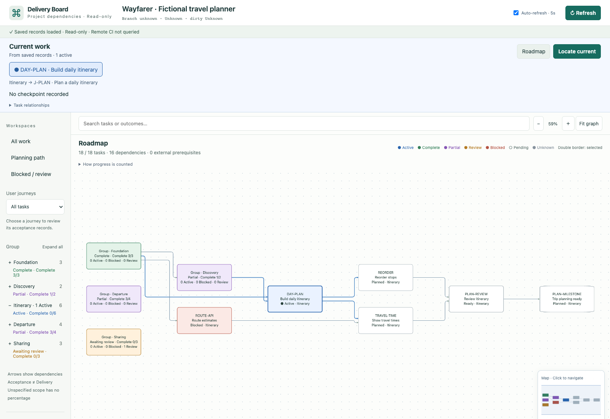

# Delivery Board

See your current task, its dependencies, and where it fits in the project.

A local board for tasks, progress and user journeys. Your agent maintains the project records; the board shows them. It runs alongside your application without changing its code.

[中文说明](README.zh-CN.md) · [Setup guide](docs/SETUP.md) · [Data format](docs/ADAPTER-CONTRACT.md)

## Try it with your agent

Paste this into a coding agent with local file and terminal access. Replace the path, or delete that line for the demo only. No Skill installation needed.

```text
Set up https://github.com/msu1201/delivery-board and open its fictional demo.
My project: /absolute/path/to/my-project

Clone the tool into a separate directory, or reuse an existing checkout.
Read README.md and skills/delivery-board/SKILL.md. Check Node.js 22+ and npm,
run npm ci, then npm run demo. Give me the local URL.

If I supplied a project path, follow the Skill's guided discovery procedure.
Read first, then ask one or two questions at a time about goals, journeys and risks.
Preserve existing records and business code; keep missing facts unknown. Show a
draft route for me to confirm or adjust before creating and opening the baseline.
Explain how to keep it updated and report any unfinished steps.
```

## What it shows

- 🔵 Current work and the tasks that depend on it.
- 🟩 Completed tasks, with separate colors for partial, waiting and blocked work.
- 🧭 Your place in the roadmap, with expandable groups and journey filters.
- 🕒 Work records with each round’s purpose, result, times and task relationships.
- ↻ Updated tasks and connections when saved project records change.



*Wayfarer is a fictional travel project. This capture translates the demo for English readers; the current viewer interface is in Chinese.*

## Prefer the terminal?

Requires Node.js 22+ and npm.

```sh
git clone https://github.com/msu1201/delivery-board.git
cd delivery-board
npm ci
npm run demo
```

Or use **Code → Download ZIP**, extract it, then run the last two commands inside the folder. The terminal prints the local URL and process PID. Busy ports are left alone.

To connect your project, run these from the tool directory:

```sh
npm run init -- "/path/to/your-project"
# Ask your agent to populate the records using the Skill, then validate:
node src/entry.js check "/path/to/your-project"
npm run open -- "/path/to/your-project"
```

`init` creates an empty `.delivery-board` folder. It preserves existing setup and does not scan your code. The prompt above handles the project review and setup together.

## Where do the tasks come from?

| What you have | What the agent does |
| --- | --- |
| Roadmap and task records | Organizes them into tasks, groups and dependencies. |
| An active project with incomplete history | Reviews docs, code and tests, then proposes a baseline for today. |
| Missing or uncertain facts | Marks them unknown and asks you to resolve important gaps. |

Code can show that an implementation exists. It cannot prove acceptance or delivery. Proposed phases and dependencies need supporting records or your planning decision. See the [project review procedure](skills/delivery-board/references/bootstrap.md).

## Keeping it current

1. You agree on a plan or task change with your agent.
2. The agent updates and validates the saved records.
3. Click Refresh to read the saved changes. Automatic refresh is off by default; opt in to local polling every five seconds.

Chat alone does not update the board. If a read fails, the previous graph stays visible with a stale warning. You can pause automatic refresh.

[Try a demo plan change →](docs/SETUP.md#keep-it-current)

## Do I need to install the Skill?

- **First use:** the agent reads the bundled Skill file directly.
- **Repeated use:** optionally copy `skills/delivery-board` to your agent's skill directory and tell it where the application lives.

The Skill contains instructions; the downloaded code runs the board. Installing the Skill does not start an agent or guarantee updates in future sessions.

## Reading progress

🔵 Active · 🟢 Complete · 🟣 Partial · 🟠 Awaiting acceptance · 🔴 Blocked · ⚪ Pending · ◻ Unknown

**4/7 means four completed tasks out of seven.** Journey verification, acceptance and delivery are tracked separately. A dark double border marks your selection.

## Details

- Local viewing has no model calls or telemetry. The viewer reads configured files and allowlisted evidence.
- The viewer does not query GitHub or CI. Your agent can use relevant, authorized records during project review.
- macOS has been tested. Windows and Linux still need validation.
- [Setup, demo changes, tests and removal](docs/SETUP.md) · [Workflow](docs/WORKFLOW.md)

[MIT license](LICENSE) · [Dependency notices](THIRD-PARTY-NOTICES.md)
