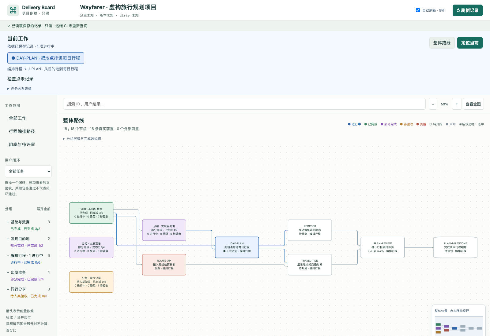

# Delivery Board

看清当前在做什么、它依赖什么，以及它在整个项目中的位置。

一个本地看板，展示任务、进度和用户闭环。Agent 维护项目记录，看板负责呈现；放在项目旁边使用，无需改造业务代码。

[English](README.md) · [详细使用说明](docs/SETUP.zh-CN.md) · [数据格式](docs/ADAPTER-CONTRACT.md)

## 把这段话交给你的 Agent

适用于能读取本地文件、运行终端的编码助手。替换项目路径；只想看演示就删掉那一行。无需先安装 Skill。

```text
请安装 https://github.com/msu1201/delivery-board，并打开虚构项目演示。
我的项目：/项目的绝对路径

把工具克隆到独立目录，已有同一仓库则复用。读取 README.zh-CN.md 和
skills/delivery-board/SKILL.md。检查 Node.js 22+ 和 npm，运行 npm ci
和 npm run demo，给我本地地址。

如果我提供了项目路径，按 Skill 引导我梳理项目。先读资料，每轮只问一两个关键问题，
帮助我想清目标、用户闭环和风险。保留已有记录和业务代码，缺失事实标为未知。
先给我路线草稿，等我确认或调整后，再校验并生成正式看板。
说明后续如何更新，以及哪些步骤尚未完成。
```

## 能看到什么

- 🔵 当前任务，以及依赖它的后续工作。
- 🟩 已完成、部分完成、待验收和受阻的任务。
- 🧭 当前工作在路线图中的位置，可展开分组、筛选闭环。
- 🕒 工作记录：每轮解决的问题、结果、起止时间和任务关系。
- ↻ 项目记录更新后，任务和连线也会更新。



*所有演示素材都使用虚构的 Wayfarer 旅行项目，不包含真实业务数据。*

## 也可以手动安装

需要 Node.js 22+ 和 npm。

```sh
git clone https://github.com/msu1201/delivery-board.git
cd delivery-board
npm ci
npm run demo
```

也可以点击 **Code → Download ZIP**，解压后在该目录运行最后两条命令。终端会显示本地地址和进程 PID，工具会避开已占用的端口。

接入自己的项目时，在工具目录运行：

```sh
npm run init -- "/你的项目路径"
# 请 Agent 按 Skill 整理项目记录，然后校验：
node src/entry.js check "/你的项目路径"
npm run open -- "/你的项目路径"
```

`init` 只创建空的 `.delivery-board` 目录，不覆盖已有设置，也不扫描代码。上面的 Agent 提示词会一起处理项目盘点和接入。

## 任务从哪里来？

| 项目现状 | Agent 如何整理 |
| --- | --- |
| 有路线图和任务记录 | 整理任务、分组与依赖关系。 |
| 已经在开发，但历史不完整 | 查看文档、代码和测试，提出当前项目的任务草稿。 |
| 事实缺失或不确定 | 标为未知，向你确认关键缺口。 |

有代码只能说明存在实现，不能证明已经验收或交付。阶段划分和依赖关系需要记录依据，或由你确认规划。详见[首次盘点流程](skills/delivery-board/references/bootstrap.md)。

## 项目变了，怎样更新？

1. 你和 Agent 确认计划或任务调整。
2. Agent 更新并校验项目记录。
3. 看板在页面可见时约每五秒重新读取。

聊天中的想法需要先写进记录。读取失败时，看板保留旧图并标注过期；自动刷新可以暂停。

[试一次演示项目的计划变更 →](docs/SETUP.zh-CN.md#项目变了看板也会变)

## 需要安装 Skill 吗？

- **首次使用**：Agent 直接读取仓库里的 Skill 文件即可。
- **经常使用**：可以把 `skills/delivery-board` 复制到 Agent 的技能目录，并告诉它应用的位置。

Skill 是工作说明，下载的代码才是看板程序。安装 Skill 不会启动常驻 Agent；后续会话仍需遵循记录维护流程。

## 怎样读进度？

🔵 进行中 · 🟢 完成 · 🟣 部分完成 · 🟠 待验收 · 🔴 受阻 · ⚪ 待开始 · ◻ 未知

**4/7 表示七项任务中完成了四项。** 闭环的验证、验收、交付分别记录。深色双边框表示选中。

## 其他说明

- 本地查看没有模型调用或遥测，只读取配置允许的文件和证据。
- 看板不查询 GitHub 或 CI；Agent 盘点时可以使用相关且已授权的记录。
- 已验证 macOS；Windows 和 Linux 尚待验证。
- [详细设置、演示变更与移除方法](docs/SETUP.zh-CN.md) · [记录维护流程](docs/WORKFLOW.md)

[MIT 许可证](LICENSE) · [依赖声明](THIRD-PARTY-NOTICES.md)
